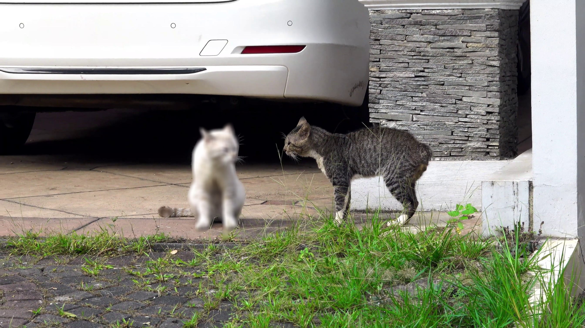

# Anonymal

Anonymal provides the ability to efficiently manually anonymize videos quickly and easily. Simply scrub through a video in near-real-time and draw bounding boxes around objects you'd like to anonymize, controlled primarily with the keyboard. Existing software tools attempt to take this process entirely out of the hands of the user and often miss important detail and are tuned to specific anonymization targets, while a manual approach using video-editing software is highly time-consuming.

This repo and method are developed by Eric Zelikman and Xindi Wu closely based on that of the CVPR 2019 paper **Fast Online Object Tracking and Segmentation: A Unifying Approach** by 
[Qiang Wang](http://www.robots.ox.ac.uk/~qwang/)\*, [Li Zhang](http://www.robots.ox.ac.uk/~lz)\*, [Luca Bertinetto](http://www.robots.ox.ac.uk/~luca)\*, [Weiming Hu](https://scholar.google.com/citations?user=Wl4tl4QAAAAJ&hl=en), [Philip H.S. Torr](https://scholar.google.it/citations?user=kPxa2w0AAAAJ&hl=en&oi=ao)
**CVPR 2019** <br />
**[[Paper](https://arxiv.org/abs/1812.05050)] [[Video](https://youtu.be/I_iOVrcpEBw)] [[Project Page](http://www.robots.ox.ac.uk/~qwang/SiamMask)]** <br />


<div align="center">
  
</div>

### Bibtex
If you find this code useful, please consider citing 
```
@misc{anonymal2020,
    title={Anonymal},
    author={Zelikman, Eric and Wu, Xindi},
    booktitle={GitHub},
    year={2020}
}
```

In addition, the implementation and method are based closely on the SiamMask paper by Wang et. al (2019), so please consider citing:

```
@inproceedings{wang2019fast,
    title={Fast online object tracking and segmentation: A unifying approach},
    author={Wang, Qiang and Zhang, Li and Bertinetto, Luca and Hu, Weiming and Torr, Philip HS},
    booktitle={Proceedings of the IEEE conference on computer vision and pattern recognition},
    year={2019}
}
```


## Contents
1. [Environment Setup](#environment-setup)
2. [Anonymal](#anonymal)

## Environment setup (Based on the SiamMask repo)
This code has been tested on Ubuntu 16.04, Python 3.6, Pytorch 0.4.1, and CUDA 11.1

- Clone the repository 
```
git clone https://github.com/ezelikman/Anonymal.git && cd Anonymal
export Anonymal=$PWD
```
- Setup python environment
```
conda create -n anonymal python=3.6
source activate anonymal
pip install -r requirements.txt
bash make.sh
```
- Add the project to your PYTHONPATH
```
export PYTHONPATH=$PWD:$PYTHONPATH
```

## Anonymal
- [Setup](#environment-setup) your environment
- Download the SiamMask model
```shell
cd $Anonymal/experiments/siammask_sharp
wget http://www.robots.ox.ac.uk/~qwang/SiamMask_VOT.pth
wget http://www.robots.ox.ac.uk/~qwang/SiamMask_DAVIS.pth
```
- Run `video_cleaner.py` to clean the video. Hit `c` to play the video in real-time, `a` and `d` to go back or ahead 48 frames. To enter the anonymization mode, hit `space` at any point. Draw a bounding box and hit `return` (`enter`) to register the bounding box. When you are done selecting bounding boxes, hit `escape` and then `a`, `s`, or `d` depending on whether you want to start anonymizing from a few frames before the current frame, the current frame, or a few frames after the current frame. When anonymization is running, you can hit `c` to clear the current selection and play the video normally or `space` to choose a new one. `video_cleaner.py` will save lossless images to the target directory in real-time - this allows you to easily go back and forth through the video without losing your changes (unless you choose to do so), and preserves all resolution.  

```shell
cd $Anonymal/experiments/siammask_sharp
export PYTHONPATH=$PWD:$PYTHONPATH
python ../../tools/video_cleaner.py --resume SiamMask_DAVIS.pth --config config_davis.json --base_path 'demo.mp4' --target_path 'demo/'
```

- Run `video_writer.py` to combine the images and the original video into a new video.   

```shell
cd $Anonymal/experiments/siammask_sharp
export PYTHONPATH=$PWD:$PYTHONPATH
python ../../tools/video_writer.py --base_path 'demo.mp4' --target_path 'demo/'
```

<div align="center">
  
</div>

## License
Licensed under an MIT license.

